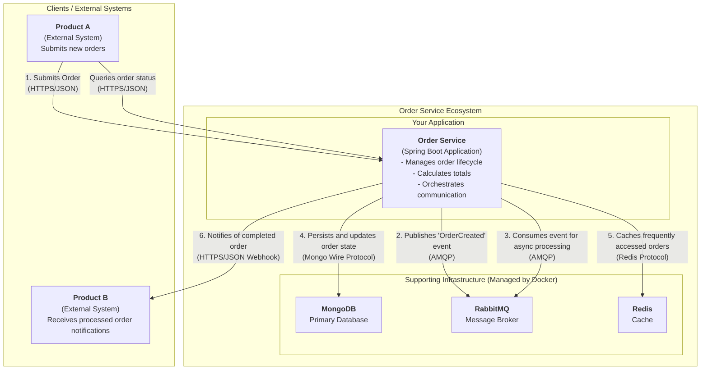

# Order Service Demo

This project is a demonstration of an order management service, built with Java and Spring Boot, applying advanced software architecture concepts such as Clean Architecture, Domain-Driven Design (DDD), and distributed systems patterns.

## Project Objective

The main objective of this service, as per the original specification, is to act as a central orchestrator in the order lifecycle:
1.  **Receive** orders from an external system (Product A).
2.  **Manage** the order's lifecycle, calculate its total value, and apply business rules.
3.  **Provide** the processed orders to a second external system (Product B).

The system was designed to handle a high volume of orders (150-200k per day), ensuring performance, resilience, and data consistency.

## Architecture & Concepts

The solution is built upon the principles of **Clean Architecture**, ensuring a clear separation of concerns, low coupling, and high testability.

* **`domain`**: The innermost, purest layer of the project. It contains the entities, aggregates (like `Order`), and core business logic, with no framework dependencies.
* **`application`**: Orchestrates the business workflows through `UseCases` (e.g., `CreateOrderUseCase`) and defines the contracts (`Gateway` interfaces) for external dependencies.
* **`infrastructure`**: The outermost layer, where technology details reside. It contains the implementations of the gateways (MongoDB, RabbitMQ), Spring configuration, API controllers, and testing infrastructure.

Other key patterns and concepts used:
* **Domain-Driven Design (DDD):** To model a rich domain and ensure the consistency of business rules.
* **API-First:** The API contract is defined in an `openapi.yaml` file, and the API code is generated from it.
* **Asynchronous Processing:** RabbitMQ is used to decouple order reception from processing, ensuring the API responds quickly and the system is resilient to failures.
* **Distributed Caching:** Redis is used to optimize read operations, improving performance.
* **Unit and Integration Testing:** The project includes a solid foundation of unit and integration tests to ensure code quality.

## Architecture Diagram (C4 Model - Container Level)

This diagram provides a high-level view of the system's architecture, focusing on the communication between its major components.



### Diagram Explanation

This high-level diagram shows the **Order Service** as the central piece that orchestrates the entire communication flow:

1.  **Input:** **Product A** communicates with the service exclusively via **HTTPS**, sending new orders and performing queries.
2.  **Asynchronous Processing:** To ensure performance and resilience, the service does not process the order immediately. Instead, it publishes an event to **RabbitMQ** (via AMQP protocol) and consumes it asynchronously.
3.  **Persistence & Caching:** During processing, the service interacts with **MongoDB** to save and update the state of the orders and with **Redis** to optimize reads by caching frequently accessed orders.
4.  **Output:** At the end of the process, the service actively notifies **Product B** by sending the completed order data via a **Webhook (HTTPS)**.

## Integration Flow

The service implements the full end-to-end flow, from receiving an order to making it available to external systems.

1.  **Product A (Input):** Simulated through calls to the REST API (`POST /orders`). The API validates the request, creates the `Order` domain object, and publishes an `order.created` event to RabbitMQ for asynchronous processing.

2.  **Order Service (Processing):**
    * An `OrderEventListener` consumes the message from the queue.
    * It delegates the work to a `ProcessOrderUseCase`, which orchestrates the order enrichment (calculating the total value, transitioning states from `RECEIVED` -> `PROCESSING` -> `COMPLETED`).
    * The order's state is persisted at each step in the MongoDB database.

3.  **Product B (Output):**
    * After the order is marked as `COMPLETED`, the `ProcessOrderUseCase` invokes the `NotificationGateway`.
    * The `WebhookNotificationGateway` implementation actively sends the complete, processed `Order` object via **HTTP POST** to an external endpoint.
    * For demonstration purposes, this endpoint is configured in the `application.properties` file to point to a **[Webhook.site](https://webhook.site/)** URL, allowing for real-time visualization of the sent data.

## Tech Stack

* **Language & Framework:** Java 21, Spring Boot 3
* **Database:** MongoDB
* **Messaging:** RabbitMQ
* **Cache:** Redis
* **API:** Spring Web, OpenAPI 3 (Swagger)
* **Build & Dependencies:** Maven
* **Testing:** JUnit 5, Mockito, Testcontainers, AssertJ
* **Other Libraries:** Lombok, MapStruct
* **Runtime Environment:** Docker & Docker Compose

## How to Run the Project

### Prerequisites
* Git
* Java (JDK) 21 or higher
* Apache Maven 3.9+
* Docker and Docker Compose

### Execution Steps

1.  **Clone the Repository:**
    ```sh
    git clone [https://github.com/frekele/order-service-demo.git](https://github.com/frekele/order-service-demo.git)
    cd order-service-demo
    ```

2.  **Start the Infrastructure with Docker:**
    This command will start the MongoDB, RabbitMQ, and Redis containers in the background.
    ```sh
    docker compose up -d
    ```
    You can check if the services are running with `docker compose ps`.

3.  **Build and Install Dependencies:**
    This command compiles the project, generates the API code from the `openapi.yaml` file, and runs the tests.
    ```sh
    mvn clean install
    ```

4.  **Run the Application:**
    Navigate to the infrastructure module and use the Spring Boot plugin to start the service.
    ```sh
    cd infrastructure/
    mvn spring-boot:run
    ```

The application will be available at `http://localhost:8080`.

## Exploring the API

After starting the application, you can access the interactive API documentation (Swagger UI) in your browser:

* **Swagger UI:** [http://localhost:8080/swagger-ui.html](http://localhost:8080/swagger-ui.html)

From this interface, you can explore all endpoints and execute test requests directly.

* **Postman Guide:** For detailed examples on how to call each endpoint with Postman, including success and error scenarios, see our guide: **[How to Call the API](how-to-call-api.md)**

## Running the Tests

The project contains a suite of unit and integration tests. To run all tests, use the following Maven command from the project root:

```sh
mvn clean verify
```
* **Coverage Report:** After the run, a code coverage report generated by JaCoCo will be available at `infrastructure/target/site/jacoco/index.html`.

### License:
This project is **licensed** under the **[MIT License]**. The terms of the license are as follows:

    MIT License
    
    Copyright (c) 2025 @frekele<Leandro Kersting de Freitas>
    
    Permission is hereby granted, free of charge, to any person obtaining a copy
    of this software and associated documentation files (the "Software"), to deal
    in the Software without restriction, including without limitation the rights
    to use, copy, modify, merge, publish, distribute, sublicense, and/or sell
    copies of the Software, and to permit persons to whom the Software is
    furnished to do so, subject to the following conditions:
    
    The above copyright notice and this permission notice shall be included in all
    copies or substantial portions of the Software.
    
    THE SOFTWARE IS PROVIDED "AS IS", WITHOUT WARRANTY OF ANY KIND, EXPRESS OR
    IMPLIED, INCLUDING BUT NOT LIMITED TO THE WARRANTIES OF MERCHANTABILITY,
    FITNESS FOR A PARTICULAR PURPOSE AND NONINFRINGEMENT. IN NO EVENT SHALL THE
    AUTHORS OR COPYRIGHT HOLDERS BE LIABLE FOR ANY CLAIM, DAMAGES OR OTHER
    LIABILITY, WHETHER IN AN ACTION OF CONTRACT, TORT OR OTHERWISE, ARISING FROM,
    OUT OF OR IN CONNECTION WITH THE SOFTWARE OR THE USE OR OTHER DEALINGS IN THE
    SOFTWARE.

[MIT License]: https://github.com/frekele/order-service-demo/blob/develop/LICENSE
